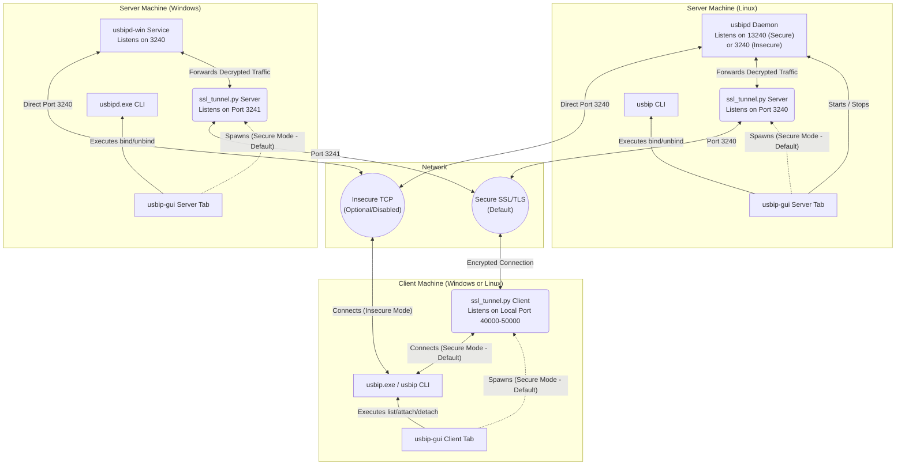
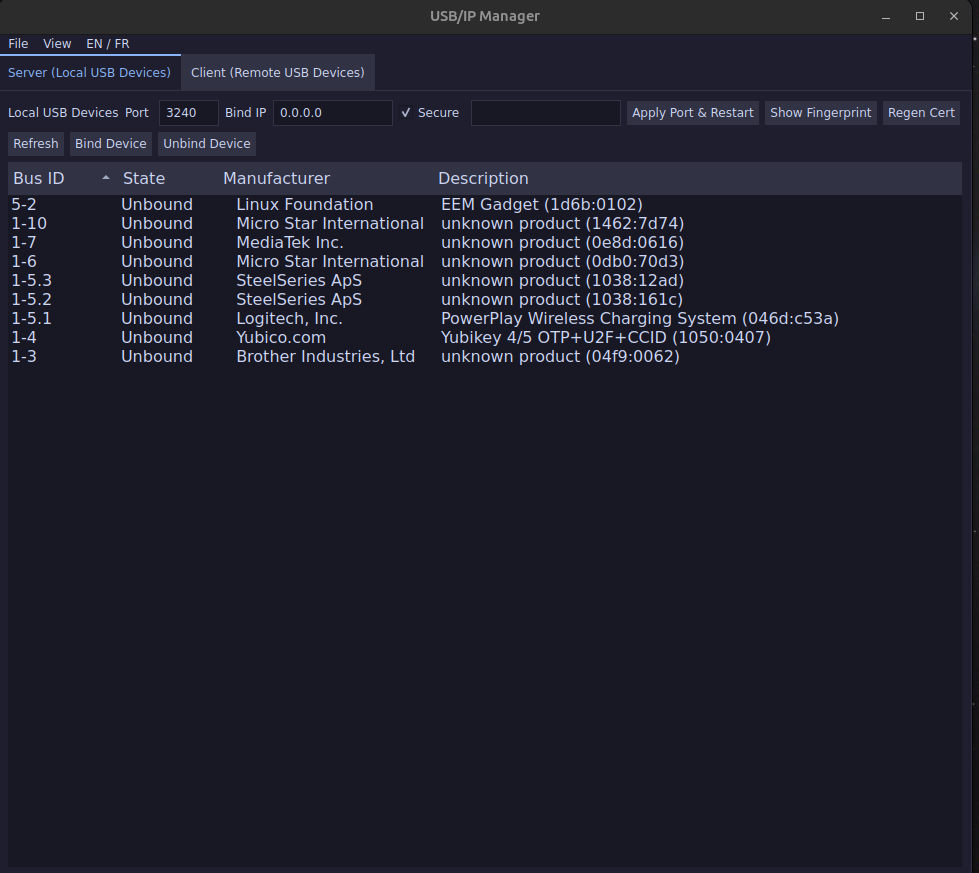
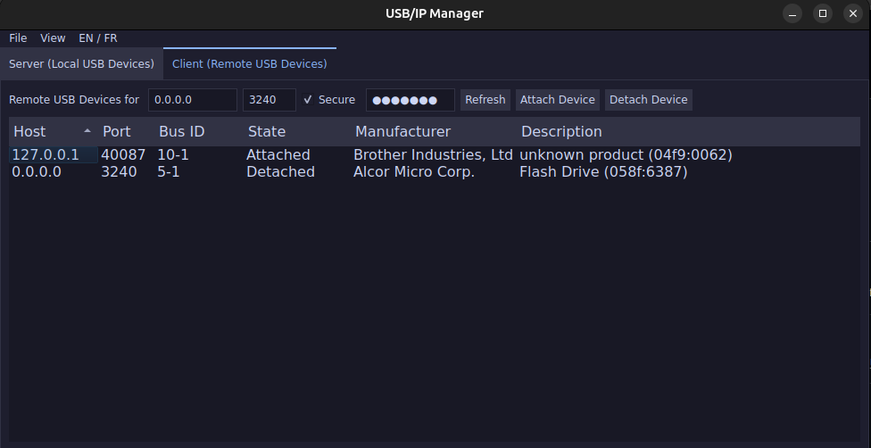
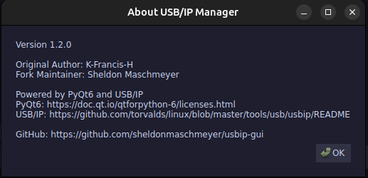
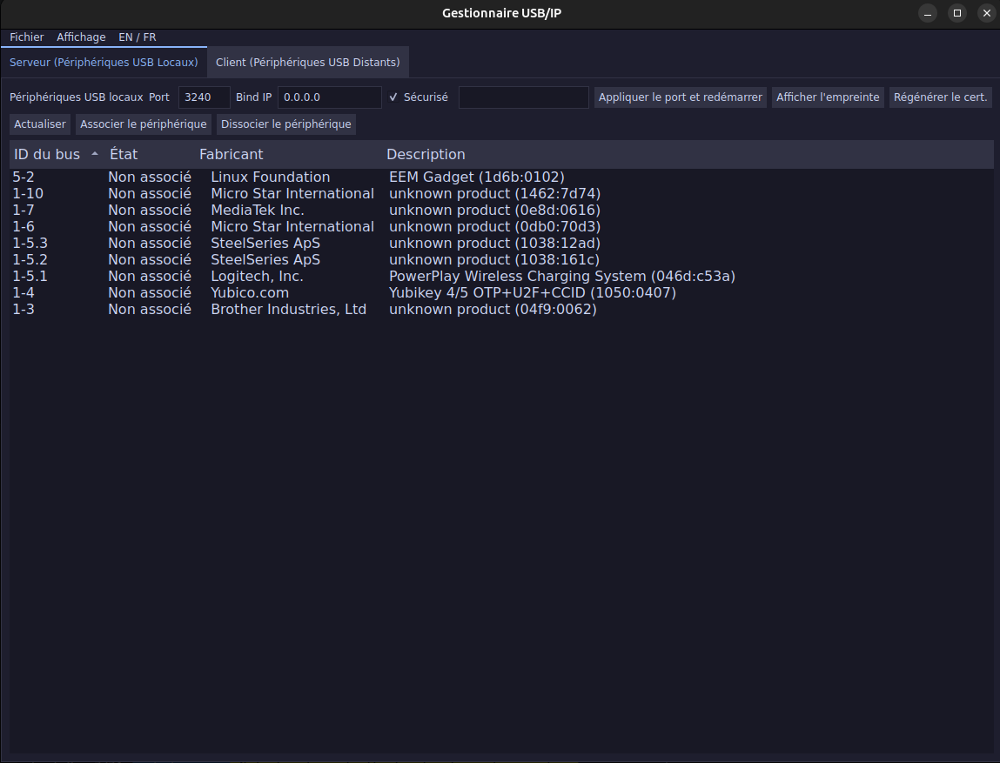
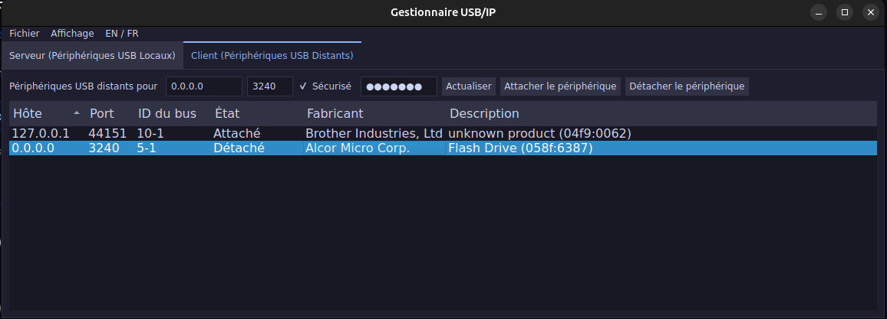
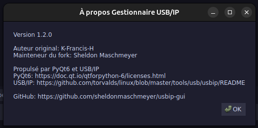

# USB/IP Manager

- [USB/IP Manager](#usbip-manager)
  - [Docker](#docker)
  - [Translations](#translations)
  - [Secure Connection (SSL Tunneling)](#secure-connection-ssl-tunneling)
    - [How it works](#how-it-works)
    - [Connecting over the Internet](#connecting-over-the-internet)
  - [Windows Setup](#windows-setup)
  - [Host System Requirements](#host-system-requirements)
  - [Local Installation (Without Docker)](#local-installation-without-docker)
  - [Development Commands](#development-commands)
  - [Tasks](#tasks)
  - [Architecture](#architecture)
  - [Screenshots](#screenshots)
  - [References](#references)
  - [Donations](#donations)
  - [License](#license)

This is a fork of K-Francis-H's `usbip-gui`, created to integrate SSL/SSH
encryption directly into the graphical interface. While `usbip` can currently be
tunnelled securely via SSH from the command line, this fork aims to make secure
USB sharing over the internet as fast and seamless as commercial alternatives
like USB Network Gate (eveusb).

USB Network Gate offers a cross-platform GUI (Windows and Mac) and relies on its
own proprietary kernel module rather than `usbip`. This is a useful workaround
for devices like the Jetson Xavier where `usbip` modules aren't installed by
default. However, its reliance on unstable cumbersome recurring license key
checks makes it unreliable. Since `usbip` is fully open-source and free of
licensing restrictions, this fork seeks to provide a simplified, faster, and
more dependable secure USB sharing experience.

Additionally, this fork has migrated the GUI framework from Tkinter to Qt
(PyQt6). This modernization provides a significantly improved user experience,
featuring superior font rendering quality and native 4K high-DPI scaling out of
the box, eliminating the need for the cumbersome custom magnification code that
Tkinter previously required.

## Docker

I prefer using Docker rather than integrating directly onto the host system to
keep the environment completely isolated. This avoids installing system-wide
dependencies on your machine (like `python3-tkinter`, `meson`, etc.). Because
Docker provides a consistent, reproducible, and clean environment without
complex setup steps, it is ideal for both development and production.

To open an interactive shell inside the Docker container:

```zsh
docker compose -f ./docker-compose.yml run usbip-gui /bin/zsh
```

Once inside the container, you can run the application using `pixi`:

```zsh
pixi run usbip
```

Alternatively, to start the application directly without an interactive shell, use:

```zsh
docker compose -f ./docker-compose.yml up usbip-gui
```

## Translations

If you make changes to the English or French translations in the `.po` files
(`po/en.po` or `po/fr_CA.po`), you will need to compile them into `.mo` files
for the changes to take effect in the application.

Run the following commands from the root directory to compile the `.po` files
into the `share/locale` directory:

```zsh
mkdir -p share/locale/en/LC_MESSAGES share/locale/fr_CA/LC_MESSAGES
msgfmt po/en.po -o share/locale/en/LC_MESSAGES/usbip-gui.mo
msgfmt po/fr_CA.po -o share/locale/fr_CA/LC_MESSAGES/usbip-gui.mo
```

## Secure Connection (SSL Tunneling)

This fork introduces a seamlessly integrated SSL proxy mechanism to encrypt
`usbip` traffic over the internet using self-signed certificates and a custom
pre-shared password. `usbip` normally transmits data over unencrypted TCP, which
is highly insecure on public networks.

### How it works
**Note:** Port 3240 used in explanations but, you may use a custom port.
When the **Secure** checkbox is enabled, the application spawns an isolated
Python-based SSL tunneling script (`ssl_tunnel.py`):
1. **On the Server (Host):** The tunnel dynamically generates a temporary
   self-signed RSA certificate and binds to the default `usbip` port (`3240`).
   The actual `usbipd` service is re-assigned to listen on an internal-only port
   (`13240`).
2. **On the Client:** A background client proxy binds to a random local port
   (e.g. `45864`) and initiates a secure SSL connection to the server on port
   `3240`. `usbip` commands on the client (like `list` and `attach`) are
   transparently forwarded to this local proxy.
3. **Authentication:** The server verifies the pre-shared password before
   allowing any traffic to reach the underlying `usbipd` daemon.

### Connecting over the Internet

To securely share a USB device across the internet:
1. **Port Forwarding:** You only need to open and port-forward TCP port
   **`3240`** on the Server's router. You do **not** need to open port `13240`.
2. **Start the Server:** In the GUI's "Server" tab, check the **Secure** box,
   enter a secure password, and click **Restart Server**.
3. **Connect the Client:** In the GUI's "Client" tab, enter the Server's public
   IP address or hostname in the **Host** field. Leave the **Port** as `3240`.
4. Check the **Secure** box and enter the exact same password you set on the
    server.
5. Click **Refresh Remote** or **Attach** to seamlessly connect over the
   encrypted tunnel!

## Windows Setup

1. Run the installer script from PowerShell or double-click on it:
   ```powershell
   win_installers/install_usbip_on_windows.bat
   ```
2. (Optional) Reboot the computer.
3. Run the app:
   - Use the **USBIP Manager** desktop icon, from start menu, or
   - Run from the repository directory:
     ```powershell
     pixi run usbip
     ```

## Host System Requirements

While Docker provides a consistent environment, `usbip` fundamentally relies on
Linux kernel modules to function. Therefore, the **host machine must be running
Linux** and have the following kernel modules available: `usbip_core`,
`usbip_host`, and `vhci_hcd`.

On Ubuntu-based systems, you can usually ensure these are present by installing
the `linux-tools-generic` package. The Docker container operates with
`privileged: true` to access and load these modules from the host kernel.

## Local Installation (Without Docker)

If you prefer to run the application directly on your host system without
Docker:

1. Ensure you have the system dependencies installed: `linux-tools-generic`
   and `hwdata`.
2. Ensure you have [pixi](https://pixi.sh/) installed.
3. Start the application by running:
   ```zsh
   pixi run usbip
   ```
*Note: The application automatically executes `setup_usbip.sh` on startup if the
required kernel modules aren't loaded. This script uses `sudo` to run `modprobe`
and start the `usbipd` daemon, so you may be prompted for your password.*

## Development Commands

This project uses `pixi` for environment and task management. If you are
developing or contributing, the following commands are available:

* `pixi run format`: Formats the code using `black`.
* `pixi run lint`: Runs `flake8`, `pylint`, `pyright`, and `mypy` to check code
  quality.
* `pixi run test`: Runs the test suite via `pytest` with coverage reporting.

## Tasks

- [x] Dockerize and configure a comfortable coding environment.
- [x] Apply types and linting rules, reviewing the code thoroughly before adding
  new features.
- [x] reducing/eliminating global variable usage
- [x] Add SSL/SSH encryption feature.
- [x] Move code into modules, i.e. compartmentalize sections of the gui.py.
- [x] Migrate tkinter to Qt.
- [x] Windows compatibility.
- [x] Windows installer.
- [ ] Fully packaged Inno Setup.
- [x] Cross-architecture (ARM and x86) production testing.
- [x] Look at K-Francis-H's remaining TODOs.

## Architecture

The following diagram illustrates the network and data flow between the `usbip-gui` Client and Server modes across Windows and Linux environments.

A key architectural difference to note is how the server daemon is managed depending on the operating system:
- **Linux:** The `usbip-gui` explicitly starts, stops, and manages the lifecycle of the `usbipd` daemon whenever the server is started or restarted.
- **Windows:** The underlying `usbipd-win` tool installs itself as a persistent background Windows Service. The GUI does not start or stop this background service directly; it merely interfaces with it to bind and unbind devices.



Figure 0: Overview Diagram

## Screenshots


Figure 1: English Server



Figure 2: English Client



Figure 3: English About



Figure 4: French Server



Figure 5: French Client



Figure 6: French About

## References
[Original K-Francis-H's README](https://github.com/K-Francis-H/usbip-gui/blob/main/README.md)

## Donations

[](https://paypal.me/sheldonmaschmeyer)

Thank you 😀

## License
This project is licensed under the GPL-3.0 License - see the [LICENSE](LICENSE)
file for details.
